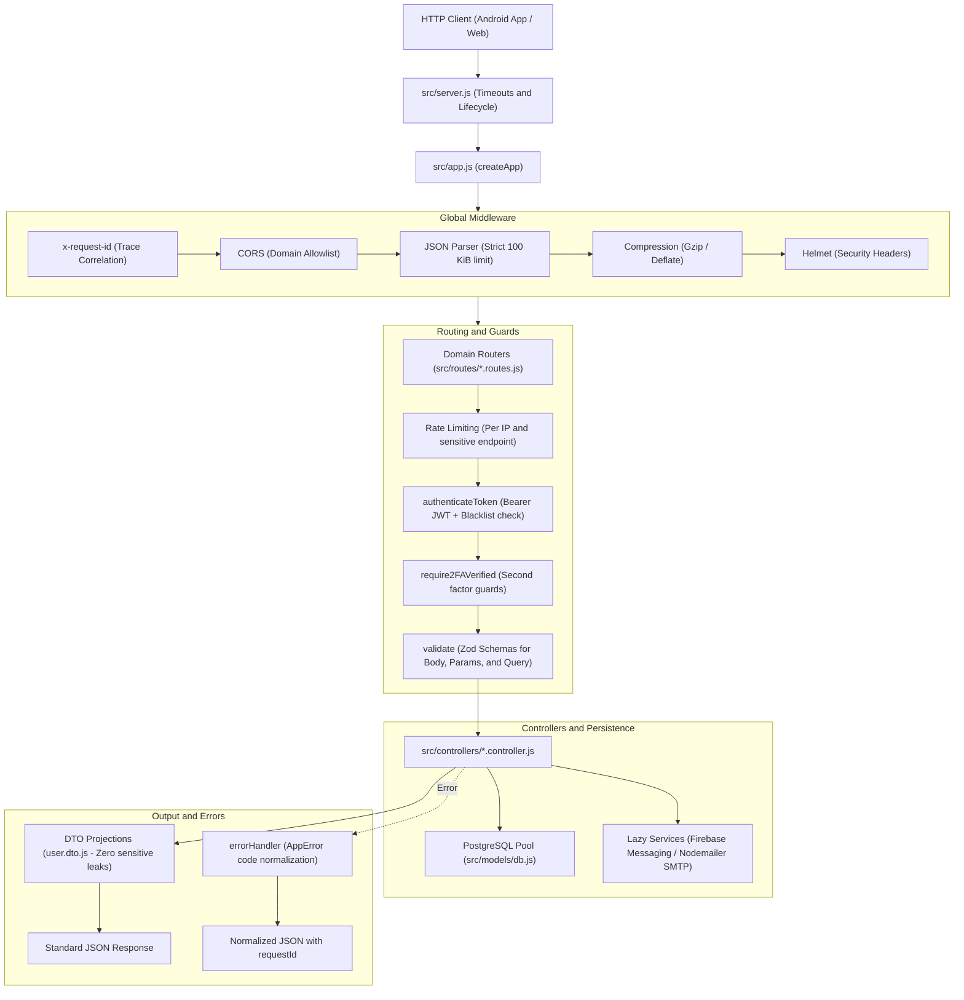

<p align="center">
  
</p>

<h1 align="center">MiraiLink Backend</h1>

<p align="center">
  <strong>RESTful service engine, hardened authentication, and persistence platform for the MiraiLink social network.</strong><br>
  <em>Built with Node.js 22, Express 5, PostgreSQL 16, Zod validation, TOTP 2FA, and OpenAPI 3.1 contract.</em>
</p>

<p align="center">
  <a href="README.md">Español</a> · <b>English</b>
</p>

<p align="center">
  <a href="https://github.com/FeryaelJustice/MiraiLink" target="_blank">
    
  </a>
  <a href="https://play.google.com/store/apps/details?id=com.feryaeljustice.mirailink" target="_blank">
    
  </a>
</p>

<p align="center">
  =22-339933?style=flat-square&logo=nodedotjs&logoColor=white" alt="Node.js 22+" />
  
  
  
  
  
  
  
</p>

- - -

## Table of Contents

- [Table of Contents](#table-of-contents)
- [Overview](#overview)
- [Architecture and Request Pipeline](#architecture-and-request-pipeline)
  - [Data Architecture](#data-architecture)
- [API Domain Matrix and Modules](#api-domain-matrix-and-modules)
- [Security and Cryptography](#security-and-cryptography)
  - [Two-Phase Authentication Protocol (2FA)](#two-phase-authentication-protocol-2fa)
  - [Binary Image Signature Validation](#binary-image-signature-validation)
- [Response Format and Normalized Errors](#response-format-and-normalized-errors)
  - [Standardized Error Responses](#standardized-error-responses)
  - [Common HTTP Status Codes](#common-http-status-codes)
- [Testing Strategy and Suite](#testing-strategy-and-suite)
  - [Continuous Integration (CI)](#continuous-integration-ci)
- [Repository Structure](#repository-structure)
- [Prerequisites and Getting Started](#prerequisites-and-getting-started)
  - [Prerequisites](#prerequisites)
  - [Step-by-Step Installation](#step-by-step-installation)
- [Development and Operational Commands](#development-and-operational-commands)
- [Detailed Documentation Guide](#detailed-documentation-guide)
- [Known Limitations](#known-limitations)
- [Contact and License](#contact-and-license)

- - -

## Overview

**MiraiLink Backend** is the core engine powering the MiraiLink social and dating platform. It provides a robust, secure, and high-performance service layer connecting users through shared passions in anime, manga, and gaming.

The service is engineered under strict software quality standards:
- **43 Verified RESTful Operations**: Covering authentication, profile management, photos with binary magic-byte verification, swipe/matching algorithms, private messaging, otaku culture catalogs, and moderation.
- **Strict Zod Validation**: Schema parsing and type coercion across query, route params, and request bodies before any controller executes.
- **Multi-Layer Security**: Bearer JWT authentication backed by a revoked token blacklist, two-factor authentication (2FA) with TOTP and bcrypt-hashed recovery codes, adaptive rate limiting, and security headers configured via Helmet and CORS.
- **Decoupled Architecture for Testing**: Express application definition (`src/app.js`) is separated from the network listener process (`src/server.js`), enabling fast Supertest suites without opening TCP sockets or requiring warm external connections.

- - -

## Architecture and Request Pipeline

Every incoming HTTP request traverses a sequential, deterministic, and secure pipeline:



### Data Architecture

No heavy ORM is used: controllers run **parameterized SQL queries** directly through a centralized PostgreSQL connection pool (`src/models/db.js`), eliminating SQL injection vulnerabilities and guaranteeing atomic transactions (`BEGIN`, `COMMIT`, `ROLLBACK`) for critical operations such as matches, recovery code consumption, and photo uploads.

- - -

## API Domain Matrix and Modules

The API features 43 operations categorized into 9 domain modules:

| Domain | Route Prefix | Controller | Primary Persistence | Functional Description |
| :--- | :--- | :--- | :--- | :--- |
| **Android Version** | `/api/app` | `app.controller.js` | `app_versions` | Version verification and client compatibility enforcement. |
| **Authentication & 2FA** | `/api/auth` | `auth.controller.js` | `users`, `user_2fa`, `token_blacklist` | Registration, login, email verification, password reset, and TOTP 2FA flow. |
| **User Profile** | `/api/user`, `/api/users` | `user.controller.js` | `users`, `user_interests` | Bio, anime interests, games, gender, and preference management. |
| **Photos & Media** | `/api/userphotos` | `photo.controller.js` | `user_photos`, filesystem | Transactional upload with magic-byte validation and primary avatar management. |
| **Discovery (Swipes)** | `/api/swipes` | `swipe.controller.js` | `users`, `likes`, `dislikes` | Discovery card feeds and Like/Dislike interaction recording. |
| **Matches** | `/api/matches` | `match.controller.js` | `matches` | Mutual match listing and conversation activation. |
| **Messaging & Chat** | `/api/chats` | `chat.controller.js` | `chats`, `chat_members`, `chat_messages` | Private chat history, message delivery, read status, and unread counters. |
| **Otaku/Gamer Catalogs** | `/api/catalog` | `catalog.controller.js` | `animes`, `games` | Browsing and searching preloaded anime and gaming titles. |
| **Moderation & Support** | `/api/reports`, `/api/feedback` | Dedicated controllers | `reports`, `feedback` | Inappropriate behavior reporting and user feedback intake. |

- - -

## Security and Cryptography

MiraiLink Backend implements proactive security defenses across all layers:

```
           +-------------------------------------------------------+
           |                 DEFENSE IN DEPTH                      |
           +-------------------------------------------------------+
           | 1. Perimeter: Helmet, CORS allowlist, Rate Limiting   |
           | 2. Transport: Bounded JSON (100 KiB), x-request-id    |
           | 3. Access: Bearer JWT (24h) with token blacklist      |
           | 4. Two-Factor: TOTP (speakeasy) + bcrypt hash         |
           | 5. Encryption: AES-256-GCM for user secrets           |
           | 6. Files: Binary magic-byte signature validation      |
           | 7. Projection: Public DTOs preventing data leaks      |
           +-------------------------------------------------------+
```

### Two-Phase Authentication Protocol (2FA)

1. **Phase 1 (Credentials)**: `POST /api/auth/login`
   - If the user has 2FA enabled, the backend **does not issue an access token**.
   - It returns `requires2FA: true`, a signed short-lived `challengeToken` (5-minute validity, `purpose: 2fa-login`), and `expiresIn`.
2. **Phase 2 (Verification)**: `POST /api/auth/2fa/loginVerifyLastStep`
   - Requires the `challengeToken` and the 6-digit TOTP code (or a backup recovery code).
   - Validates the second factor and, upon success, issues the final `access-token` (`purpose: access`).
   - Backup recovery codes are verified using `bcrypt` and transactionally consumed after a single use.

### Binary Image Signature Validation

To prevent malicious file injection (shells, executables, or polyglots), the `validateImage` middleware inspects the genuine binary magic bytes within the in-memory buffer:
- **JPEG**: Signature `FF D8 FF`
- **PNG**: Signature `89 50 4E 47`
- **WebP**: Signature `RIFF` with `WEBP` subtype

Any uploaded file failing to match its declared magic bytes is rejected immediately with HTTP 415 before anything touches disk.

- - -

## Response Format and Normalized Errors

All requests include an `x-request-id` header for end-to-end tracing.

### Standardized Error Responses

```json
{
  "code": "VALIDATION_ERROR",
  "message": "Request validation failed",
  "requestId": "4f9d8e72-3c1a-4a2b-9e81-2244668899aa",
  "details": [
    {
      "field": "body.password",
      "code": "too_small",
      "message": "String must contain at least 8 character(s)"
    }
  ]
}
```

### Common HTTP Status Codes

| Status | Business Code | Trigger |
| :--- | :--- | :--- |
| `400` | `VALIDATION_ERROR` | Request params, query, or body violate Zod validation schemas. |
| `401` | `TOKEN_REQUIRED` / `INVALID_TOKEN` / `TOKEN_REVOKED` | Missing Bearer header, expired token, or token listed in blacklist. |
| `403` | `ACCOUNT_UNVERIFIED` / `CORS_REJECTED` | Unverified email address or origin disallowed by CORS policy. |
| `404` | `NOT_FOUND` / `USER_NOT_FOUND` / `CHAT_NOT_FOUND` | Requested resource does not exist or is inaccessible. |
| `409` | `ACCOUNT_EXISTS` | Uniqueness conflict (email or username already registered). |
| `415` | `INVALID_IMAGE_SIGNATURE` | Uploaded payload does not contain a valid image binary signature. |
| `429` | `RATE_LIMITED` | IP request rate limit threshold exceeded. |
| `500` | `INTERNAL_ERROR` | Unexpected server condition (sensitive details are never leaked). |

- - -

## Testing Strategy and Suite

The project includes an automated test pipeline powered by **Vitest**, **Supertest**, and **V8 Coverage**:

```
                 / \
                /   \       OpenAPI Route Drift Check (scripts/check-openapi-routes.js)
               /-----\
              /       \     PostgreSQL Schema & Migration Tests (tests/database)
             /---------\
            /           \   HTTP Integration & Auth Tests (tests/integration)
           /-------------\
          /               \ Unit Tests & Validation Schemas (tests/unit)
         -------------------
```

### Continuous Integration (CI)

The GitHub Actions workflow (`.github/workflows/ci.yml`) runs automatically on every pull request and push to the primary branch:
1. Provisions a dedicated **PostgreSQL 16** service container.
2. Performs deterministic package installation (`npm ci`) on **Node.js 22**.
3. Executes static analysis with ESLint (`npm run lint`).
4. Runs the comprehensive test suite with coverage enforcement (`npm run test:coverage`).
5. Enforces parity between active Express routes and the OpenAPI 3.1 specification (`npm run check:routes`).

- - -

## Repository Structure

```text
MiraiLink-Backend/
├── docs/                                  # Exhaustive technical documentation
│   ├── SDMD.md                            # Spec-Driven Mobile Development methodology guide
│   ├── PROMPTS.md                         # Canonical initialization prompts and interceptors
│   ├── generic_rules.md                   # Core architecture, validation, and security rules
│   ├── mobile_guidelines.md               # Android mobile integration and network resilience
│   ├── spec_template.md                   # Canonical functional specification template
│   ├── plan_template.md                   # Canonical technical architecture plan template
│   ├── api-reference.md                   # 43 API operations catalog
│   ├── architecture.md                    # System architecture and technical decisions
│   ├── code-reference.md                  # Methods, parameters, and exports reference
│   ├── codebase-map.md                    # Navigable codebase and directory map
│   ├── database.md                        # PostgreSQL relational schema and indices
│   ├── future-vps-deployment.md           # Production VPS deployment guide (Nginx, PM2)
│   ├── openapi.yaml                       # Official OpenAPI 3.1 specification
│   ├── runtime-and-configuration.md       # Environment variables and lifecycle
│   ├── security-review.md                 # Security audit and controls review
│   ├── testing-strategy.md                # Testing strategy and coverage thresholds
│   └── features/                          # Persistent features directory (Spec-Anchor)
├── scripts/
│   └── check-openapi-routes.js            # Express vs OpenAPI route drift checker
├── src/
│   ├── app.js                             # Express application definition and middleware
│   ├── server.js                          # HTTP entrypoint and network listener
│   ├── config/
│   │   ├── env.js                         # Environment parsing and validation
│   │   └── firebaseAdmin.js               # Lazy Firebase Messaging initialization
│   ├── controllers/                       # 10 business logic controllers
│   ├── database/
│   │   ├── db.sql                         # PostgreSQL baseline database schema
│   │   └── migrations/                    # Schema and security migrations
│   ├── dto/
│   │   └── user.dto.js                    # Secure user projection allowlists
│   ├── middleware/                        # Auth, 2FA, rate limit, upload, error handler
│   ├── models/
│   │   └── db.js                          # Shared PostgreSQL connection pool
│   ├── routes/                            # Modular Express domain routers
│   ├── services/                          # Push notifications and photo storage
│   ├── utils/                             # Cryptography, magic bytes, and SMTP mailer
│   └── validation/                        # Zod request validation schemas
├── tests/
│   ├── database/                          # Database schema and migration tests
│   ├── integration/                       # HTTP endpoint and authentication tests
│   └── unit/                              # Utility and middleware unit tests
├── .env.example                           # Environment configuration template
├── eslint.config.js                       # Modern ESLint 10 configuration
├── package.json                           # Project manifest, dependencies, and scripts
├── README.md                              # Primary documentation (Spanish)
└── README.en.md                           # Documentation in English (i18n)
```

- - -

## Prerequisites and Getting Started

### Prerequisites

- **Node.js**: Version 22.x or later.
- **npm**: Version compatible with `package-lock.json` v3.
- **PostgreSQL**: Version 16 recommended.
- **SMTP Server (Optional)**: Required only for sending real email verification and password reset tokens.
- **Firebase Credentials (Optional)**: Required only for delivering push notifications to Android devices.

### Step-by-Step Installation

1. **Clone the repository**:
   ```bash
   git clone https://github.com/FeryaelJustice/MiraiLink-Backend.git
   cd MiraiLink-Backend
   ```

2. **Install dependencies deterministically**:
   ```bash
   npm ci
   ```

3. **Configure the environment**:
   ```powershell
   # On Windows PowerShell
   Copy-Item .env.example .env

   # On Linux / macOS
   cp .env.example .env
   ```
   *Edit `.env` with your PostgreSQL database credentials and JWT secret keys.*

4. **Initialize PostgreSQL database**:
   ```bash
   # Load baseline schema
   psql -U postgres -d mirailink -f src/database/db.sql

   # Apply security hardening migration
   psql -U postgres -d mirailink -f src/database/migrations/002_security_hardening.sql
   ```

5. **Start the development server**:
   ```bash
   npm run dev
   ```
   The service will listen on `http://localhost:3000` with hot-reloading via Nodemon.

- - -

## Development and Operational Commands

| Command | Description / Purpose |
| :--- | :--- |
| `npm run dev` | Launches development server with Nodemon and `.env` loading. |
| `npm start` | Runs the production-optimized process (`NODE_ENV=production`). |
| `npm run build` | Validates entrypoint syntax without binding network ports. |
| `npm test` | Runs the automated test suite with Vitest. |
| `npm run test:unit` | Runs unit tests exclusively. |
| `npm run test:integration` | Runs HTTP integration and authentication tests. |
| `npm run test:database` | Validates schema and migrations against PostgreSQL. |
| `npm run test:coverage` | Generates complete code coverage reports using the V8 engine. |
| `npm run lint` | Analyzes source code using ESLint 10. |
| `npm run lint:fix` | Automatically fixes style and formatting discrepancies. |
| `npm run check:routes` | Verifies route parity against the OpenAPI 3.1 contract. |
| `npm run check` | Comprehensive quality gate: lint, coverage, and OpenAPI routes. |

- - -

## Detailed Documentation Guide

The repository includes in-depth technical documentation in the `docs/` folder. The recommended reading order is:

1. [Architecture](docs/architecture.md): Request lifecycle, bounded limits, dependencies, and design decisions.
2. [Codebase Map](docs/codebase-map.md): Specific responsibilities of each project folder and file.
3. [Code Reference](docs/code-reference.md): Exported functions, parameters, side effects, and consumers.
4. [API Guide](docs/api-reference.md): Authentication, payloads, responses, and 43-operation catalog.
5. [OpenAPI 3.1 Specification](docs/openapi.yaml): Machine-readable contract for Swagger, Redoc, and agents.
6. [Database](docs/database.md): Relational models, tables, indexes, and security migrations.
7. [Runtime and Configuration](docs/runtime-and-configuration.md): Environment variables and operational lifecycle.
8. [Testing Strategy](docs/testing-strategy.md): Test suites, coverage requirements, and existing limits.
9. [Security Review](docs/security-review.md): Audit of implemented security controls and mitigations.
10. [Future VPS Deployment](docs/future-vps-deployment.md): Production Linux deployment with PM2 and Nginx.
11. [SDMD Methodology](docs/SDMD.md): Spec-Driven Mobile Development engineering standard (Spec-Anchor).

- - -

## Known Limitations

- **In-Memory Rate Limiter**: Currently uses volatile single-process memory; a shared cache (such as Redis) is required for multi-instance horizontal scaling.
- **Local Media Storage**: Uploaded photos are stored on the local filesystem; distributed clusters will require an S3-compatible object bucket.
- **Route Versioning**: The current API version does not use route version prefixes (e.g., `/api/v1/`).

- - -

## Contact and License

Created and maintained by **Feryael Justice** as part of the flagship **MiraiLink** portfolio project.

- **Android Client Repository**: [FeryaelJustice/MiraiLink](https://github.com/FeryaelJustice/MiraiLink)
- **Production Google Play Store App**: [Download MiraiLink](https://play.google.com/store/apps/details?id=com.feryaeljustice.mirailink)
- **Issue Tracker**: [GitHub Issues](https://github.com/FeryaelJustice/MiraiLink-Backend/issues)

Licensed under the terms of the [ISC License](LICENSE).

<p align="center">
  <sub>Built with dedication to foster modern social connections and communities.</sub>
</p>
