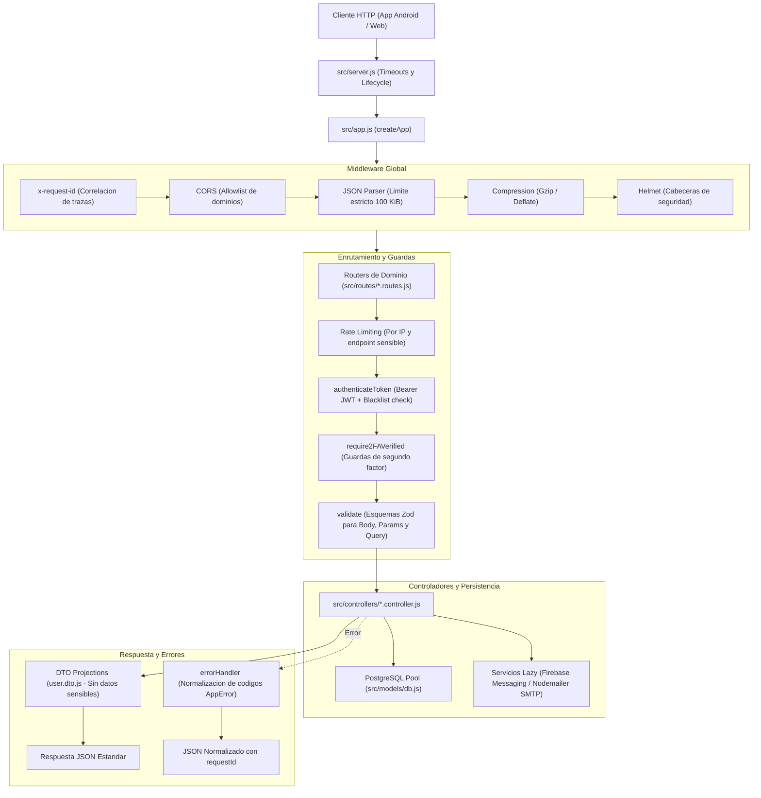

<p align="center">
  
</p>

<h1 align="center">MiraiLink Backend</h1>

<p align="center">
  <strong>Motor de servicios RESTful, autenticacion blindada y persistencia para la plataforma social MiraiLink.</strong><br>
  <em>Construido con Node.js 22, Express 5, PostgreSQL 16, validacion Zod, 2FA TOTP y contrato OpenAPI 3.1.</em>
</p>

<p align="center">
  <b>Español</b> · <a href="README.en.md">English</a>
</p>

<p align="center">
  <a href="https://github.com/FeryaelJustice/MiraiLink" target="_blank">
    
  </a>
  <a href="https://play.google.com/store/apps/details?id=com.feryaeljustice.mirailink" target="_blank">
    
  </a>
</p>

<p align="center">
  =22-339933?style=flat-square&logo=nodedotjs&logoColor=white" alt="Node.js 22+" />
  
  
  
  
  
  
  
</p>

- - -

## Indice

- [Vision General](#vision-general)
- [Arquitectura y Pipeline de Peticiones](#arquitectura-y-pipeline-de-peticiones)
- [Matriz de Dominios y Modulos de la API](#matriz-de-dominios-y-modulos-de-la-api)
- [Seguridad y Criptografia](#seguridad-y-criptografia)
- [Formato de Respuestas y Errores Normalizados](#formato-de-respuestas-y-errores-normalizados)
- [Estrategia y Suite de Testing](#estrategia-y-suite-de-testing)
- [Estructura del Repositorio](#estructura-del-repositorio)
- [Requisitos y Puesta en Marcha](#requisitos-y-puesta-en-marcha)
- [Comandos de Desarrollo y Operacion](#comandos-de-desarrollo-y-operacion)
- [Guia de Documentacion Detallada](#guia-de-documentacion-detallada)
- [Limitaciones Conocidas](#limitaciones-conocidas)
- [Contacto y Licencia](#contacto-y-licencia)

- - -

## Vision General

**MiraiLink Backend** es el corazon del ecosistema social y de citas MiraiLink. Proporciona una plataforma de servicios robusta, segura y de alto rendimiento que conecta usuarios a traves de afinidades tematicas en anime, manga y videojuegos.

El servicio esta desarrollado bajo estandares rigurosos de calidad de software:
- **43 Operaciones RESTful Verificadas**: Cubriendo autenticacion, gestion de perfil, fotografias con validacion de firmas binarias, algoritmo de swipes/matching, mensajeria privada, catalogos de cultura otaku y moderacion.
- **Validacion Estricta con Zod**: Parseo de esquemas y coercion segura en query, params y body antes de que cualquier controlador intervenga.
- **Seguridad Multicapa**: Autenticacion basada en Bearer JWT con lista negra de tokens revocados, autenticacion en dos pasos (2FA) con TOTP y codigos de recuperacion con hash bcrypt, rate limiting adaptativo y cabeceras de proteccion con Helmet y CORS.
- **Desacoplamiento para Testing**: La definicion de la aplicacion Express (`src/app.js`) esta separada del proceso de red (`src/server.js`), posibilitando la ejecucion de suites de pruebas con Supertest sin levantar sockets TCP ni depender de servicios externos en frio.

- - -

## Arquitectura y Pipeline de Peticiones

El procesamiento de cada solicitud HTTP sigue un pipeline secuencial, determinista y seguro:



### Arquitectura de Datos

No se utiliza un ORM pesado: los controladores ejecutan **consultas SQL parametrizadas** directamente mediante un pool unico de conexiones PostgreSQL (`src/models/db.js`), eliminando riesgos de inyeccion SQL y asegurando transacciones atomicas (`BEGIN`, `COMMIT`, `ROLLBACK`) para operaciones criticas como matches, consumo de codigos de recuperacion y subida de fotografias.

- - -

## Matriz de Dominios y Modulos de la API

La API cuenta con 43 operaciones organizadas en 9 modulos de dominio:

| Dominio | Prefijo de Ruta | Controlador | Persistencia Principal | Descripcion Funcional |
| :--- | :--- | :--- | :--- | :--- |
| **Version Android** | `/api/app` | `app.controller.js` | `app_versions` | Control de versiones requeridas y compatibilidad con el cliente movil. |
| **Autenticacion y 2FA** | `/api/auth` | `auth.controller.js` | `users`, `user_2fa`, `token_blacklist` | Registro, login, verificacion de email, recuperacion de clave y flujo TOTP 2FA. |
| **Perfil de Usuario** | `/api/user`, `/api/users` | `user.controller.js` | `users`, `user_interests` | Consulta y edicion de biografia, animes, videojuegos, genero y preferencias. |
| **Fotografias y Media** | `/api/userphotos` | `photo.controller.js` | `user_photos`, filesystem | Subida transaccional con validacion de magic bytes y gestion de avatar principal. |
| **Descubrimiento (Swipes)** | `/api/swipes` | `swipe.controller.js` | `users`, `likes`, `dislikes` | Obtencion de cartas de descubrimiento y registro de interacciones Like/Dislike. |
| **Coincidencias (Matches)**| `/api/matches` | `match.controller.js` | `matches` | Listado y detalle de matches mutuos activos. |
| **Mensajeria y Chat** | `/api/chats` | `chat.controller.js` | `chats`, `chat_members`, `chat_messages`| Historial de chats privados, envio de mensajes, lectura y contador de no leidos. |
| **Catalogos Otaku/Gamer** | `/api/catalog` | `catalog.controller.js` | `animes`, `games` | Listado y busqueda de animes y franquicias de videojuegos precargadas. |
| **Moderacion y Soporte** | `/api/reports`, `/api/feedback` | Controladores dedicados | `reports`, `feedback` | Denuncia de conductas inapropiadas y buzon de sugerencias de la aplicacion. |

- - -

## Seguridad y Criptografia

MiraiLink Backend incorpora politicas de seguridad proactivas en cada capa:

```
           +-------------------------------------------------------+
           |               DEFENSA EN PROFUNDIDAD                 |
           +-------------------------------------------------------+
           | 1. Perimetro: Helmet, CORS allowlist, Rate Limiting   |
           | 2. Transporte: JSON acotado (100 KiB), x-request-id   |
           | 3. Acceso: Bearer JWT (24h) con lista negra de tokens |
           | 4. Doble Factor: TOTP (speakeasy) + hash bcrypt       |
           | 5. Cifrado: AES-256-GCM para secretos de usuario      |
           | 6. Archivos: Validacion de cabeceras magicas binarias |
           | 7. Proyeccion: DTOs publicos sin fugas de datos       |
           +-------------------------------------------------------+
```

### Protocolo de Autenticacion en Dos Fases (2FA)

1. **Fase 1 (Credenciales)**: `POST /api/auth/login`
   - Si el usuario tiene 2FA activado, el backend **no entrega un access token**.
   - Devuelve `requires2FA: true`, un `challengeToken` temporal firmado (validez de 5 minutos, `purpose: 2fa-login`) y `expiresIn`.
2. **Fase 2 (Verificacion)**: `POST /api/auth/2fa/loginVerifyLastStep`
   - Requiere el `challengeToken` y el codigo TOTP de 6 digitos (o un codigo de recuperacion).
   - Valida el segundo factor y, si es correcto, emite el `access-token` definitivo (`purpose: access`).
   - Los codigos de recuperacion se verifican con `bcrypt` y se invalidan transaccionalmente tras un unico uso.

### Validacion Binaria de Imagenes

Para prevenir inyecciones de archivos maliciosos (shells, ejecutables o polyglots), el middleware `validateImage` inspecciona las cabeceras binarias reales (Magic Bytes) del buffer en memoria:
- **JPEG**: Firma `FF D8 FF`
- **PNG**: Firma `89 50 4E 47`
- **WebP**: Firma `RIFF` con subtipo `WEBP`

Cualquier archivo que no coincida con su firma real es rechazado de inmediato con codigo HTTP 415 antes de escribir nada en disco.

- - -

## Formato de Respuestas y Errores Normalizados

Todas las peticiones incluyen la cabecera de trazabilidad `x-request-id`.

### Respuestas de Error Estandarizadas

```json
{
  "code": "VALIDATION_ERROR",
  "message": "Request validation failed",
  "requestId": "4f9d8e72-3c1a-4a2b-9e81-2244668899aa",
  "details": [
    {
      "field": "body.password",
      "code": "too_small",
      "message": "String must contain at least 12 character(s)"
    }
  ]
}
```

### Codigos de Estado HTTP Habituales

| Status | Codigo de Negocio | Causa |
| :--- | :--- | :--- |
| `400` | `VALIDATION_ERROR` | Los parametros, query o body no satisfacen los esquemas Zod. |
| `401` | `TOKEN_REQUIRED` / `INVALID_TOKEN` / `TOKEN_REVOKED` | Falta la cabecera Bearer, el token ha expirado o esta en lista negra. |
| `403` | `ACCOUNT_UNVERIFIED` / `CORS_REJECTED` | Cuenta sin verificar o dominio de origen no permitido por CORS. |
| `404` | `NOT_FOUND` / `USER_NOT_FOUND` / `CHAT_NOT_FOUND` | El recurso solicitado no existe o no es accesible para el usuario. |
| `409` | `ACCOUNT_EXISTS` | Conflicto de duplicidad (email o nombre de usuario ya registrado). |
| `415` | `INVALID_IMAGE_SIGNATURE` | El archivo subido no contiene una firma valida de imagen. |
| `429` | `RATE_LIMITED` | Se ha superado el umbral de peticiones permitido para la IP. |
| `500` | `INTERNAL_ERROR` | Error imprevisto en el servidor (los detalles sensibles no se exponen al cliente). |

- - -

## Estrategia y Suite de Testing

El proyecto cuenta con un sistema de pruebas automatizadas con **Vitest**, **Supertest** y **V8 Coverage**:

```
                 / \
                /   \       OpenAPI Route Drift Check (scripts/check-openapi-routes.js)
               /-----\
              /       \     PostgreSQL Schema & Migration Tests (tests/database)
             /---------\
            /           \   HTTP Integration & Auth Tests (tests/integration)
           /-------------\
          /               \ Unit Tests & Validation Schemas (tests/unit)
         -------------------
```

### Integracion Continua (CI)

El workflow de GitHub Actions (`.github/workflows/ci.yml`) se ejecuta de manera automatica en cada pull request y push a la rama principal:
1. Levanta un contenedor de servicio con **PostgreSQL 16**.
2. Ejecuta instalacion determinista (`npm ci`) sobre **Node.js 22**.
3. Pasa el linter estatico (`npm run lint`).
4. Ejecuta toda la bateria de tests con reporte de cobertura (`npm run test:coverage`).
5. Valida la correspondencia estricta entre las rutas de Express y la especificacion OpenAPI 3.1 (`npm run check:routes`).

- - -

## Estructura del Repositorio

```text
MiraiLink-Backend/
├── docs/                                  # Documentacion tecnica exhaustiva
│   ├── api-reference.md                   # Catalogo de las 43 operaciones de la API
│   ├── architecture.md                    # Diseno del sistema y decisiones tecnicas
│   ├── code-reference.md                  # Referencia de metodos, parametros y retornos
│   ├── codebase-map.md                    # Mapa navegable de carpetas y archivos
│   ├── database.md                        # Modelo relacional, tablas e indices PostgreSQL
│   ├── future-vps-deployment.md           # Guia de despliegue en VPS (Nginx, PM2, systemd)
│   ├── openapi.yaml                       # Especificacion oficial OpenAPI 3.1
│   ├── runtime-and-configuration.md       # Variables de entorno y ciclo de ejecucion
│   ├── security-review.md                 # Auditoria y revision de seguridad
│   └── testing-strategy.md                # Estrategia de pruebas y umbrales de cobertura
├── scripts/
│   └── check-openapi-routes.js            # Script de paridad entre Express y OpenAPI
├── src/
│   ├── app.js                             # Definicion de la aplicacion Express y middleware
│   ├── server.js                          # Punto de entrada HTTP y arranque del listener
│   ├── config/
│   │   ├── env.js                         # Carga y validacion de variables de entorno
│   │   └── firebaseAdmin.js               # Inicializacion lazy de Firebase Messaging
│   ├── controllers/                       # 10 controladores de logica de negocio
│   ├── database/
│   │   ├── db.sql                         # Esquema base de la base de datos PostgreSQL
│   │   └── migrations/                    # Migraciones de seguridad y esquema
│   ├── dto/
│   │   └── user.dto.js                    # Proyecciones seguras de datos de usuario
│   ├── middleware/                        # Auth, 2FA, rate limit, upload, error handler
│   ├── models/
│   │   └── db.js                          # Pool compartido de PostgreSQL
│   ├── routes/                            # Routers modulares de Express
│   ├── services/                          # Notificaciones push y persistencia de fotos
│   ├── utils/                             # Criptografia, validacion binaria y mailer SMTP
│   └── validation/                        # Esquemas de validacion Zod
├── tests/
│   ├── database/                          # Pruebas de esquema y migraciones SQL
│   ├── integration/                       # Pruebas de endpoints HTTP y autenticacion
│   └── unit/                              # Pruebas unitarias de utilidades y middleware
├── .env.example                           # Plantilla de variables de entorno
├── eslint.config.js                       # Configuracion moderna de ESLint 10
└── package.json                           # Manifiesto del proyecto y scripts
```

- - -

## Requisitos y Puesta en Marcha

### Prerrequisitos

- **Node.js**: Version 22.x o superior.
- **npm**: Version compatible con `package-lock.json` v3.
- **PostgreSQL**: Version 16 recomendada.
- **Servidor SMTP (Opcional)**: Requerido solo si se desean enviar correos de verificacion o recuperacion reales.
- **Credenciales Firebase (Opcional)**: Requeridas solo para la emision de notificaciones push a dispositivos Android.

### Instalacion Paso a Paso

1. **Clonar el repositorio**:
   ```bash
   git clone https://github.com/FeryaelJustice/MiraiLink-Backend.git
   cd MiraiLink-Backend
   ```

2. **Instalar dependencias de forma determinista**:
   ```bash
   npm ci
   ```

3. **Configurar el entorno**:
   ```powershell
   # En Windows PowerShell
   Copy-Item .env.example .env

   # En Linux / macOS
   cp .env.example .env
   ```
   *Edita `.env` y sustituye los valores de ejemplo por tus credenciales de PostgreSQL y claves JWT.*

4. **Inicializar la base de datos PostgreSQL**:
   ```bash
   # Cargar el esquema inicial
   psql -U postgres -d mirailink -f src/database/db.sql

   # Aplicar la migracion de seguridad
   psql -U postgres -d mirailink -f src/database/migrations/002_security_hardening.sql
   ```

5. **Iniciar el servidor en modo desarrollo**:
   ```bash
   npm run dev
   ```
   El servicio arrancara en `http://localhost:3000` con recarga en caliente mediante Nodemon.

- - -

## Comandos de Desarrollo y Operacion

| Comando | Descripcion / Proposito |
| :--- | :--- |
| `npm run dev` | Arranca el entorno de desarrollo con Nodemon y lectura de `.env`. |
| `npm start` | Inicia el proceso optimizado de produccion (`NODE_ENV=production`). |
| `npm run build` | Comprueba la sintaxis del entrypoint sin arrancar el proceso. |
| `npm test` | Ejecuta toda la suite de pruebas automatizadas con Vitest. |
| `npm run test:unit` | Ejecuta exclusivamente las pruebas unitarias. |
| `npm run test:integration` | Ejecuta las pruebas de integracion HTTP y autenticacion. |
| `npm run test:database` | Valida el esquema y las migraciones contra PostgreSQL. |
| `npm run test:coverage` | Genera el informe completo de cobertura de codigo con motor V8. |
| `npm run lint` | Analiza el codigo fuente mediante ESLint 10. |
| `npm run lint:fix` | Corrige de forma automatica desviaciones de estilo con ESLint. |
| `npm run check:routes` | Comprueba que todas las rutas coincidan con la especificacion OpenAPI 3.1. |
| `npm run check` | Verificacion integral de calidad: lint, cobertura y contrato de rutas. |

- - -

## Guia de Documentacion Detallada

El repositorio incluye documentacion tecnica profunda en la carpeta `docs/`. Se recomienda su lectura en el siguiente orden:

1. [Arquitectura](docs/architecture.md): Recorrido de peticiones, limites, dependencias y decisiones de diseno.
2. [Mapa del Codigo](docs/codebase-map.md): Funcion especifica de cada directorio y archivo del proyecto.
3. [Referencia de Codigo](docs/code-reference.md): Funciones, parametros, efectos colaterales y consumidores.
4. [Guia de API](docs/api-reference.md): Autenticacion, requests, responses y catalogo de las 43 operaciones.
5. [Especificacion OpenAPI 3.1](docs/openapi.yaml): Contrato legible por maquinas para Swagger, Redoc y agentes.
6. [Base de Datos](docs/database.md): Modelo relacional, tablas, indices y migraciones de seguridad.
7. [Runtime y Configuracion](docs/runtime-and-configuration.md): Variables de entorno y ciclo operativo.
8. [Estrategia de Testing](docs/testing-strategy.md): Suites de pruebas, cobertura y limites actuales.
9. [Revision de Seguridad](docs/security-review.md): Analisis de controles implementados y mitigacion de riesgos.
10. [Despliegue Futuro en VPS](docs/future-vps-deployment.md): Arquitectura de despliegue en Linux con PM2 y Nginx.
11. [Metodologia SDMD](docs/SDMD.md): Estandar de desarrollo guiado por especificaciones con IA (Spec-Anchor).

- - -

## Limitaciones Conocidas

- **Rate Limiter en Memoria**: Actualmente utiliza memoria volatil de proceso; en un despliegue horizontal multi-instancia debe configurarse un almacenamiento compartido como Redis.
- **Almacenamiento de Multimedia**: Las fotografias se persisten en el sistema de archivos local; para clusters distribuidos se requerira un bucket de objetos (S3 o compatible).
- **Rutas de la API**: La version actual de la API no incluye prefijo de version en la ruta (por ejemplo `/api/v1/`).

- - -

## Contacto y Licencia

Creado y mantenido por **Feryael Justice** como parte integral del proyecto estrella de portafolio **MiraiLink**.

- **Repositorio Cliente Android**: [FeryaelJustice/MiraiLink](https://github.com/FeryaelJustice/MiraiLink)
- **App en Google Play Store**: [Descargar MiraiLink](https://play.google.com/store/apps/details?id=com.feryaeljustice.mirailink)
- **Reporte de Incidencias**: [GitHub Issues](https://github.com/FeryaelJustice/MiraiLink-Backend/issues)

Licencia bajo los terminos de la [Licencia ISC](LICENSE).

<p align="center">
  <sub>Construido con dedicacion para impulsar comunidades y experiencias sociales modernas.</sub>
</p>

