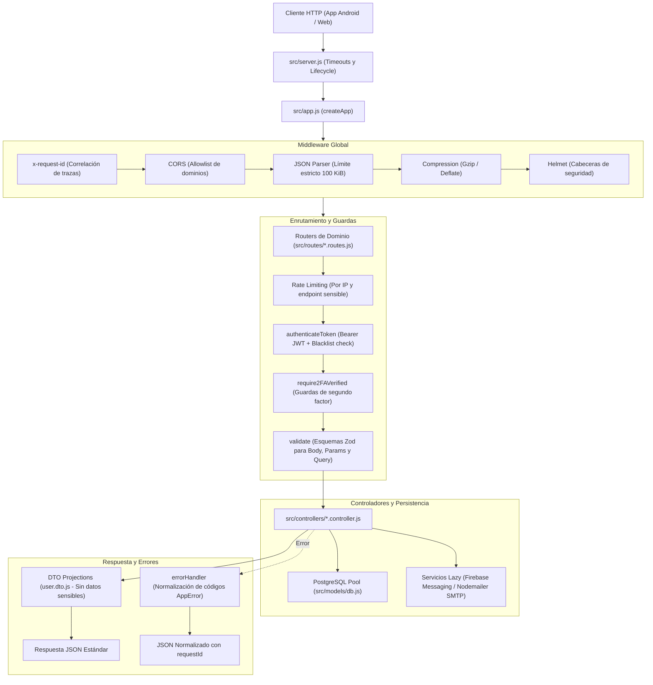

> **Estudio técnico del proyecto:** [Guía maestra en español](docs/guia-maestra.md), con documentos por tema, diagramas, configuración, casos de error y revisión conectada con el otro repositorio.

<p align="center">
  
</p>

<h1 align="center">MiraiLink Backend</h1>

<p align="center">
  <strong>Motor de servicios RESTful, autenticación y persistencia para la plataforma social MiraiLink.</strong><br>
  <em>Construido con Node.js 22, Express 5, PostgreSQL 16, validación Zod, 2FA TOTP y contrato OpenAPI 3.1.</em>
</p>

<p align="center">
  <b>Español</b> · <a href="README.en.md">English</a>
</p>

<p align="center">
  <a href="https://github.com/FeryaelJustice/MiraiLink" target="_blank">
    
  </a>
  <a href="https://play.google.com/store/apps/details?id=com.feryaeljustice.mirailink" target="_blank">
    
  </a>
</p>

<p align="center">
  =22-339933?style=flat-square&logo=nodedotjs&logoColor=white" alt="Node.js 22+" />
  
  
  
  
  
  
  
</p>

- - -

## Índice

- [Índice](#índice)
- [Visión General](#visión-general)
- [Arquitectura y Pipeline de Peticiones](#arquitectura-y-pipeline-de-peticiones)
  - [Arquitectura de Datos](#arquitectura-de-datos)
- [Matriz de Dominios y Módulos de la API](#matriz-de-dominios-y-módulos-de-la-api)
- [Seguridad y Criptografía](#seguridad-y-criptografía)
  - [Protocolo de Autenticación en Dos Fases (2FA)](#protocolo-de-autenticación-en-dos-fases-2fa)
  - [Validación Binaria de Imágenes](#validación-binaria-de-imágenes)
- [Formato de Respuestas y Errores Normalizados](#formato-de-respuestas-y-errores-normalizados)
  - [Respuestas de Error Estandarizadas](#respuestas-de-error-estandarizadas)
  - [Códigos de Estado HTTP Habituales](#códigos-de-estado-http-habituales)
- [Estrategia y Suite de Testing](#estrategia-y-suite-de-testing)
  - [Integración Continua (CI)](#integración-continua-ci)
- [Estructura del Repositorio](#estructura-del-repositorio)
- [Requisitos y Puesta en Marcha](#requisitos-y-puesta-en-marcha)
  - [Prerrequisitos](#prerrequisitos)
  - [Instalación Paso a Paso](#instalación-paso-a-paso)
- [Comandos de Desarrollo y Operación](#comandos-de-desarrollo-y-operación)
- [Guía de Documentación Detallada](#guía-de-documentación-detallada)
- [Limitaciones Conocidas](#limitaciones-conocidas)
- [Contacto y Licencia](#contacto-y-licencia)

- - -

## Visión General

**MiraiLink Backend** es el corazón del ecosistema social y de citas MiraiLink. Proporciona una plataforma de servicios robusta, segura y de alto rendimiento que conecta usuarios a través de afinidades temáticas en anime, manga y videojuegos.

El servicio está desarrollado bajo estándares rigurosos de calidad de software:
- **59 Operaciones RESTful Documentadas**: Cubriendo autenticación, gestión de perfil, fotografías con validación de firmas binarias, algoritmo de swipes/matching, mensajería privada, catálogos de cultura otaku y moderación.
- **Validación Estricta con Zod**: Parseo de esquemas y coerción segura en query, params y body antes de que cualquier controlador intervenga.
- **Seguridad Multicapa**: Autenticación basada en Bearer JWT con lista negra de tokens revocados, autenticación en dos pasos (2FA) con TOTP y códigos de recuperación con hash bcrypt, rate limiting adaptativo y cabeceras de protección con Helmet y CORS.
- **Desacoplamiento para Testing**: La definición de la aplicación Express (`src/app.js`) está separada del proceso de red (`src/server.js`), posibilitando la ejecución de suites de pruebas con Supertest sin levantar sockets TCP ni depender de servicios externos en frío.

- - -

## Arquitectura y Pipeline de Peticiones

El procesamiento de cada solicitud HTTP sigue un pipeline secuencial, determinista y seguro:


```mermaid
flowchart TD
    Client["Cliente HTTP (App Android / Web)"] --> Srv["src/server.js (Timeouts y Lifecycle)"]
    Srv --> App["src/app.js (createApp)"]

    subgraph Middleware ["Middleware Global"]
        ReqId["x-request-id (Correlación de trazas)"]
        Cors["CORS (Allowlist de dominios)"]
        Body["JSON Parser (Límite estricto 100 KiB)"]
        Comp["Compression (Gzip / Deflate)"]
        Hel["Helmet (Cabeceras de seguridad)"]
        ReqId --> Cors --> Body --> Comp --> Hel
    end

    App --> Middleware

    subgraph Routing ["Enrutamiento y Guardas"]
        DomainRouter["Routers de Dominio (src/routes/*.routes.js)"]
        RateLimit["Rate Limiting (Por IP y endpoint sensible)"]
        AuthGuard["authenticateToken (Bearer JWT + Blacklist check)"]
        TwoFactorGuard["require2FAVerified (Guardas de segundo factor)"]
        ZodVal["validate (Esquemas Zod para Body, Params y Query)"]
        DomainRouter --> RateLimit --> AuthGuard --> TwoFactorGuard --> ZodVal
    end

    Middleware --> Routing

    subgraph Execution ["Controladores y Persistencia"]
        Controller["src/controllers/*.controller.js"]
        PG["PostgreSQL Pool (src/models/db.js)"]
        LazySvcs["Servicios Lazy (Firebase Messaging / Nodemailer SMTP)"]
        ZodVal --> Controller
        Controller --> PG
        Controller --> LazySvcs
    end

    subgraph Output ["Respuesta y Errores"]
        DTO["DTO Projections (user.dto.js - Sin datos sensibles)"]
        ErrorH["errorHandler (Normalización de códigos AppError)"]
        Controller --> DTO --> Resp["Respuesta JSON Estándar"]
        Controller -.->|Error| ErrorH --> RespErr["JSON Normalizado con requestId"]
    end
```

### Arquitectura de Datos

No se utiliza un ORM pesado: los controladores ejecutan **consultas SQL parametrizadas** directamente mediante un pool único de conexiones PostgreSQL (`src/models/db.js`), eliminando riesgos de inyección SQL y asegurando transacciones atómicas (`BEGIN`, `COMMIT`, `ROLLBACK`) para operaciones críticas como matches, consumo de códigos de recuperación y subida de fotografías.

- - -

## Matriz de Dominios y Módulos de la API

El contrato vigente documenta 59 operaciones. La siguiente tabla resume dominios; el inventario completo está en [Contratos HTTP](docs/estudio/contratos-http.md):

| Dominio | Prefijo de Ruta | Controlador | Persistencia Principal | Descripción Funcional |
| :--- | :--- | :--- | :--- | :--- |
| **Versión Android** | `/api/app` | `app.controller.js` | `app_versions` | Control de versiones requeridas y compatibilidad con el cliente móvil. |
| **Autenticación y 2FA** | `/api/auth` | `auth.controller.js` | `users`, `user_2fa`, `token_blacklist` | Registro, login, verificación de email, recuperación de clave y flujo TOTP 2FA. |
| **Perfil de Usuario** | `/api/user`, `/api/users` | `user.controller.js` | `users`, `user_anime_interests`, `user_game_interests` | Consulta y edición de biografía, animes, videojuegos, género y preferencias. |
| **Fotografías y Media** | `/api/user/photos` | `photo.controller.js` | `user_photos`, filesystem | Subida transaccional con validación de magic bytes y gestión de avatar principal. |
| **Descubrimiento (Swipes)** | `/api/swipe` | `swipe.controller.js` | `users`, `likes`, `dislikes` | Obtención de cartas de descubrimiento y registro de interacciones Like/Dislike. |
| **Coincidencias (Matches)**| `/api/match` | `match.controller.js` | `matches` | Listado y detalle de matches mutuos activos. |
| **Mensajería y Chat** | `/api/chats` | `chat.controller.js` | `chats`, `chat_members`, `messages`| Historial de chats privados, envío de mensajes, lectura y contador de no leidos. |
| **Catálogos Otaku/Gamer** | `/api/catalog` | `catalog.controller.js` | `animes`, `games` | Listado y búsqueda de animes y franquicias de videojuegos precargadas. |
| **Moderación y Soporte** | `/api/report`, `/api/feedback` | Controladores dedicados | `reports`, `feedback` | Denuncia de conductas inapropiadas y buzon de sugerencias de la aplicación. |

- - -

## Seguridad y Criptografía

MiraiLink Backend incorpora políticas de seguridad proactivas en cada capa:

```
           +-------------------------------------------------------+
           |               DEFENSA EN PROFUNDIDAD                 |
           +-------------------------------------------------------+
           | 1. Perimetro: Helmet, CORS allowlist, Rate Limiting   |
           | 2. Transporte: JSON acotado (100 KiB), x-request-id   |
           | 3. Acceso: Bearer JWT (24h) con lista negra de tokens |
           | 4. Doble Factor: TOTP (speakeasy) + hash bcrypt       |
           | 5. Cifrado: AES-256-GCM para secretos de usuario      |
           | 6. Archivos: Validación de cabeceras mágicas binarias |
           | 7. Proyección: DTOs públicos sin fugas de datos       |
           +-------------------------------------------------------+
```

### Protocolo de Autenticación en Dos Fases (2FA)

1. **Fase 1 (Credenciales)**: `POST /api/auth/login`
   - Si el usuario tiene 2FA activado, el backend **no entrega un access token**.
   - Devuelve `requires2FA: true`, un `challengeToken` temporal firmado (validez de 5 minutos, `purpose: 2fa-login`) y `expiresIn`.
2. **Fase 2 (Verificación)**: `POST /api/auth/2fa/loginVerifyLastStep`
   - Requiere el `challengeToken` y el código TOTP de 6 dígitos (o un código de recuperación).
   - Valida el segundo factor y, si es correcto, emite el `access-token` definitivo (`purpose: access`).
   - Los códigos de recuperación se verifican con `bcrypt` y se invalidan transaccionalmente tras un único uso.

### Validación Binaria de Imágenes

Para prevenir inyecciones de archivos maliciosos (shells, ejecutables o polyglots), el middleware `validateImage` inspecciona las cabeceras binarias reales (Magic Bytes) del buffer en memoria:
- **JPEG**: Firma `FF D8 FF`
- **PNG**: Firma `89 50 4E 47`
- **WebP**: Firma `RIFF` con subtipo `WEBP`

Cualquier archivo que no coincida con su firma real es rechazado de inmediato con código HTTP 415 antes de escribir nada en disco.

- - -

## Formato de Respuestas y Errores Normalizados

Todas las peticiones incluyen la cabecera de trazabilidad `x-request-id`.

### Respuestas de Error Estandarizadas

```json
{
  "code": "VALIDATION_ERROR",
  "message": "Request validation failed",
  "requestId": "4f9d8e72-3c1a-4a2b-9e81-2244668899aa",
  "details": [
    {
      "field": "body.password",
      "code": "too_small",
      "message": "String must contain at least 8 character(s)"
    }
  ]
}
```

### Códigos de Estado HTTP Habituales

| Status | Código de Negocio | Causa |
| :--- | :--- | :--- |
| `400` | `VALIDATION_ERROR` | Los parámetros, query o body no satisfacen los esquemas Zod. |
| `401` | `TOKEN_REQUIRED` / `INVALID_TOKEN` / `TOKEN_REVOKED` | Falta la cabecera Bearer, el token ha expirado o está en lista negra. |
| `403` | `ACCOUNT_UNVERIFIED` / `CORS_REJECTED` | Cuenta sin verificar o dominio de origen no permitido por CORS. |
| `404` | `NOT_FOUND` / `USER_NOT_FOUND` / `CHAT_NOT_FOUND` | El recurso solicitado no existe o no es accesible para el usuario. |
| `409` | `ACCOUNT_EXISTS` | Conflicto de duplicidad (email o nombre de usuario ya registrado). |
| `415` | `INVALID_IMAGE_SIGNATURE` | El archivo subido no contiene una firma válida de imagen. |
| `429` | `RATE_LIMITED` | Se ha superado el umbral de peticiones permitido para la IP. |
| `500` | `INTERNAL_ERROR` | Error imprevisto en el servidor (los detalles sensibles no se exponen al cliente). |

- - -

## Estrategia y Suite de Testing

El proyecto cuenta con un sistema de pruebas automatizadas con **Vitest**, **Supertest** y **V8 Coverage**:

```
                 / \
                /   \       OpenAPI Route Drift Check (scripts/check-openapi-routes.js)
               /-----\
              /       \     PostgreSQL Schema & Migration Tests (tests/database)
             /---------\
            /           \   HTTP Integration & Auth Tests (tests/integration)
           /-------------\
          /               \ Unit Tests & Validation Schemas (tests/unit)
         -------------------
```

### Integración Continua (CI)

El workflow de GitHub Actions (`.github/workflows/ci.yml`) se ejecuta de manera automática en cada pull request y push a la rama principal:
1. Levanta un contenedor de servicio con **PostgreSQL 16**.
2. Ejecuta instalación determinista (`npm ci`) sobre **Node.js 22**.
3. Pasa el linter estático (`npm run lint`).
4. Ejecuta toda la batería de tests con reporte de cobertura (`npm run test:coverage`).
5. Valida la correspondencia estricta entre las rutas de Express y la especificación OpenAPI 3.1 (`npm run check:routes`).

- - -

## Estructura del Repositorio

```text
MiraiLink-Backend/
├── docs/                                  # Documentación técnica exhaustiva
│   ├── api-reference.md                   # Catálogo de las 59 operaciones de la API
│   ├── architecture.md                    # Diseño del sistema y decisiones técnicas
│   ├── code-reference.md                  # Referencia de métodos, parámetros y retornos
│   ├── codebase-map.md                    # Mapa navegable de carpetas y archivos
│   ├── database.md                        # Modelo relacional, tablas e índices PostgreSQL
│   ├── future-vps-deployment.md           # Guía de despliegue en VPS (Nginx, PM2, systemd)
│   ├── openapi.yaml                       # Especificación oficial OpenAPI 3.1
│   ├── runtime-and-configuration.md       # Variables de entorno y ciclo de ejecución
│   ├── security-review.md                 # Auditoría y revisión de seguridad
│   └── testing-strategy.md                # Estrategia de pruebas y umbrales de cobertura
├── scripts/
│   └── check-openapi-routes.js            # Script de paridad entre Express y OpenAPI
├── src/
│   ├── app.js                             # Definición de la aplicación Express y middleware
│   ├── server.js                          # Punto de entrada HTTP y arranque del listener
│   ├── config/
│   │   ├── env.js                         # Carga y validación de variables de entorno
│   │   └── firebaseAdmin.js               # Inicialización lazy de Firebase Messaging
│   ├── controllers/                       # 10 controladores de lógica de negocio
│   ├── database/
│   │   ├── db.sql                         # Esquema base de la base de datos PostgreSQL
│   │   └── migrations/                    # Migraciones de seguridad y esquema
│   ├── dto/
│   │   └── user.dto.js                    # Proyecciones seguras de datos de usuario
│   ├── middleware/                        # Auth, 2FA, rate limit, upload, error handler
│   ├── models/
│   │   └── db.js                          # Pool compartido de PostgreSQL
│   ├── routes/                            # Routers modulares de Express
│   ├── services/                          # Notificaciones push y persistencia de fotos
│   ├── utils/                             # Criptografía, validación binaria y mailer SMTP
│   └── validation/                        # Esquemas de validación Zod
├── tests/
│   ├── database/                          # Pruebas de esquema y migraciones SQL
│   ├── integration/                       # Pruebas de endpoints HTTP y autenticación
│   └── unit/                              # Pruebas unitarias de utilidades y middleware
├── .env.example                           # Plantilla de variables de entorno
├── eslint.config.js                       # Configuración moderna de ESLint 10
└── package.json                           # Manifiesto del proyecto y scripts
```

- - -

## Requisitos y Puesta en Marcha

### Prerrequisitos

- **Node.js**: Versión 22.x o superior.
- **npm**: Versión compatible con `package-lock.json` v3.
- **PostgreSQL**: Versión 16 recomendada.
- **Servidor SMTP (Opcional)**: Requerido solo si se desean enviar correos de verificación o recuperación reales.
- **Credenciales Firebase (Opcional)**: Requeridas solo para la emisión de notificaciones push a dispositivos Android.

### Instalación Paso a Paso

1. **Clonar el repositorio**:
   ```bash
   git clone https://github.com/FeryaelJustice/MiraiLink-Backend.git
   cd MiraiLink-Backend
   ```

2. **Instalar dependencias de forma determinista**:
   ```bash
   npm ci
   ```

3. **Configurar el entorno**:
   ```powershell
   # En Windows PowerShell
   Copy-Item .env.example .env

   # En Linux / macOS
   cp .env.example .env
   ```
   *Edita `.env` y sustituye los valores de ejemplo por tus credenciales de PostgreSQL y claves JWT.*

4. **Inicializar la base de datos PostgreSQL**:
   ```bash
   # Solo para una base local o desechable: recrea todo el esquema
   npm run db:reset

   # Insertar o actualizar usuarios de prueba, ubicaciones e intereses
   npm run db:seed
   ```
   `npm run db:seed` es repetible y también sirve después de producción. Incluye perfiles de Palma y otras localidades de Baleares, Madrid, Barcelona, Valencia, Francia, Japón, India y Estados Unidos.

   Para una base ya desplegada, no ejecutes `db:reset`. Tras desplegar el código del backend, ejecuta primero `npm run db:migrate` y después `npm run db:seed`.

5. **Iniciar el servidor en modo desarrollo**:
   ```bash
   npm run dev
   ```
   El servicio arrancará en `http://localhost:3000` con recarga en caliente mediante Nodemon.

- - -

## Comandos de Desarrollo y Operación

| Comando | Descripción / Propósito |
| :--- | :--- |
| `npm run dev` | Arranca el entorno de desarrollo con Nodemon y lectura de `.env`. |
| `npm start` | Inicia el proceso optimizado de producción (`NODE_ENV=production`). |
| `npm run build` | Comprueba la sintaxis del entrypoint sin arrancar el proceso. |
| `npm test` | Ejecuta toda la suite de pruebas automatizadas con Vitest. |
| `npm run test:unit` | Ejecuta exclusivamente las pruebas unitarias. |
| `npm run test:integration` | Ejecuta las pruebas de integración HTTP y autenticación. |
| `npm run test:database` | Valida el esquema y las migraciones contra PostgreSQL. |
| `npm run test:coverage` | Genera el informe completo de cobertura de código con motor V8. |
| `npm run lint` | Analiza el código fuente mediante ESLint 10. |
| `npm run lint:fix` | Corrige de forma automática desviaciones de estilo con ESLint. |
| `npm run check:routes` | Comprueba que todas las rutas coincidan con la especificación OpenAPI 3.1. |
| `npm run db:migrate` | Aplica una sola vez las migraciones incrementales pendientes a una base existente. No se ejecuta al arrancar el servidor. |
| `npm run db:reset` | Recrea de forma destructiva una base local o desechable. Nunca usar en producción. |
| `npm run db:reset-interactions` | Restablece matches, likes, dislikes, chats y mensajes para pruebas sin tocar cuentas, perfiles ni fotos. |
| `npm run db:seed` | Inserta o actualiza los usuarios de prueba, sus ubicaciones y sus intereses. |
| `npm run check` | Verificación integral de calidad: lint, cobertura y contrato de rutas. |

- - -

## Guía de Documentación Detallada

El repositorio incluye documentación técnica profunda en la carpeta `docs/`. Se recomienda su lectura en el siguiente orden:

1. [Arquitectura](docs/architecture.md): Recorrido de peticiones, límites, dependencias y decisiones de diseño.
2. [Mapa del Código](docs/codebase-map.md): Función específica de cada directorio y archivo del proyecto.
3. [Referencia de Código](docs/code-reference.md): Funciones, parámetros, efectos colaterales y consumidores.
4. [Guía de API](docs/api-reference.md): Autenticación, requests, responses y catálogo de las 59 operaciones.
5. [Especificación OpenAPI 3.1](docs/openapi.yaml): Contrato legible por maquinas para Swagger, Redoc y agentes.
6. [Base de Datos](docs/database.md): Modelo relacional, tablas, índices y migraciones de seguridad.
7. [Runtime y Configuración](docs/runtime-and-configuration.md): Variables de entorno y ciclo operativo.
8. [Estrategia de Testing](docs/testing-strategy.md): Suites de pruebas, cobertura y límites actuales.
9. [Revisión de Seguridad](docs/security-review.md): Análisis de controles implementados y mitigación de riesgos.
10. [Despliegue Futuro en VPS](docs/future-vps-deployment.md): Arquitectura de despliegue en Linux con PM2 y Nginx.
11. [Metodología SDMD](docs/SDMD.md): Estándar de desarrollo guiado por especificaciones con IA (Spec-Anchor).

- - -

## Limitaciones Conocidas

- **Rate Limiter en Memoria**: Actualmente utiliza memoria volátil de proceso; en un despliegue horizontal multi-instancia debe configurarse un almacenamiento compartido como Redis.
- **Almacenamiento de Multimedia**: Las fotografías se persisten en el sistema de archivos local; para clusters distribuidos se requerirá un bucket de objetos (S3 o compatible).
- **Rutas de la API**: La versión actual de la API no incluye prefijo de versión en la ruta (por ejemplo `/api/v1/`).

- - -

## Contacto y Licencia

Creado y mantenido por **Feryael Justice** como parte integral del proyecto estrella de portafolio **MiraiLink**.

- **Repositorio Cliente Android**: [FeryaelJustice/MiraiLink](https://github.com/FeryaelJustice/MiraiLink)
- **App en Google Play Store**: [Descargar MiraiLink](https://play.google.com/store/apps/details?id=com.feryaeljustice.mirailink)
- **Reporte de Incidencias**: [GitHub Issues](https://github.com/FeryaelJustice/MiraiLink-Backend/issues)

Licencia bajo los términos de la [Licencia ISC](LICENSE).

<p align="center">
  <sub>Construido con dedicación para impulsar comunidades y experiencias sociales modernas.</sub>
</p>


## Cápsula de Cristal

Modo opcional de descubrimiento mutuo y fotos veladas con progreso compartido. [Spec SDMD](docs/features/crystal_capsule/spec.md), [plan](docs/features/crystal_capsule/plan.md). Activación: CRYSTAL_CAPSULE_ENABLED=true después de db:migrate y db:seed:capsules. API aditiva con X-MiraiLink-Capabilities: crystal-capsule-v1, discovery_mode, photoPresentation, clientMessageId e include_capsule. Acciones autenticadas: /api/capsules/config y /api/capsules/{id}/actions. Respuestas personales solo en messages; los eventos no contienen textos. No se garantiza anonimato ni protección de URLs conocidas.

Reconstruir escenarios sobre usuarios existentes: `npm run db:reset-interactions` y `npm run db:test-all`. Comandos separados: `db:test-affinities`, `db:test-likes`, `db:test-capsules`; reinicio Capsule: `db:reinit-capsules`. [Requisitos y limites](docs/affinity-capsule-restoration.md).
