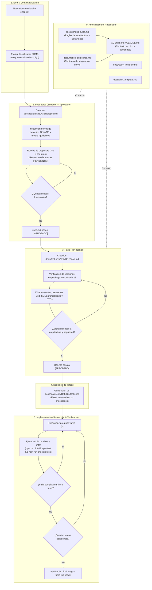

# Metodologia SDMD: Spec-Driven Mobile Development en MiraiLink Backend

Este documento describe la adopcion formal del estandar **SDMD (Spec-Driven Mobile Development)** en el backend de MiraiLink, adaptando los principios de Spec-Driven Development (SDD) al desarrollo de APIs RESTful de alto rendimiento en Express 5 y PostgreSQL 16 que dan servicio directo a la aplicacion movil Android MiraiLink (Clean Architecture, Jetpack Compose, Room Database y WebSocket/Socket.IO).

- - -

## 1. Resumen Ejecutivo y Filosofia de Diseno

### 1.1. El Problema: Indeterminismo y el Sesgo del Happy Path
Los Modelos de Lenguaje Grande (LLMs) y asistentes de codificacion presentan tres fallos criticos cuando se les solicita codigo de backend sin un arnes estructurado:
1. **Sesgo del Happy Path**: Suponen conectividad ininterrumpida, datos siempre consistentes y clientes infalibles. Ignoran fallos de red en dispositivos moviles, reintentos concurrentes que provocan condiciones de carrera (race conditions), payloads incompletos, errores de serializacion y codigos de error ambiguos.
2. **Desconexion con las Restricciones del Cliente Movil**: Disenan endpoints sin contemplar limites de ancho de banda, consumo de bateria, tiempos de espera (timeouts) en conexiones moviles 4G/5G inestables, payloads pesados que degradan la memoria del dispositivo y la necesidad de soportar el modo offline o sincronizacion asincrona.
3. **Alucinacion de Dependencias y Versiones**: Tienden a proponer metodos deprecados, middleware obsoleto o paquetes incompatibles con Node.js 22, Express 5 o PostgreSQL 16 sin verificar el catalogo de dependencias (`package.json`).

### 1.2. La Solucion: El Arnes de Seguridad (Safety Harness)
SDMD establece una regla inquebrantable: **el codigo de produccion nunca se genera directamente a partir de una idea o solicitud informal**.

Entre la intencion inicial y la primera linea de codigo ejecutable se despliega un arnes documental determinista:
- Se inspecciona el repositorio antes de asumir (`AGENTS.md`, `docs/architecture.md`, `docs/api-reference.md`, `docs/openapi.yaml`, `package.json`).
- Se encapsulan las decisiones funcionales y de contrato movil en `spec.md`.
- Se auditan las limitaciones del cliente movil y la resiliencia de red con `docs/mobile_guidelines.md`.
- Se disena la arquitectura tecnica con dependencias reales verificadas en `plan.md`.
- Se desglosa en tareas atomicas y testeables en `tasks.md`.

- - -

## 2. Enfoque Adoptado: Spec-Anchor

MiraiLink Backend adopta el modelo **Spec-Anchor**:
- Las especificaciones y planes se redactan, aprueban y versionan en Git dentro del directorio `docs/features/<nombre-feature>/`.
- Conveven de forma permanente y viva junto al codigo fuente de la aplicacion.
- Garantizan memoria historica para futuros desarrolladores y agentes de IA, evitando regresiones arquitectonicas o divergencias de contrato con la aplicacion movil.

- - -

## 3. Diagrama de Flujo Mermaid del Ciclo SDMD



- - -

## 4. Estructura de Documentos en el Repositorio

```text
MiraiLink-Backend/
├── AGENTS.md                      # Contexto global y comandos para asistentes IA
├── CLAUDE.md                      # Puntero de contexto para Claude (@AGENTS.md)
├── README.md                      # Documentacion principal en espanol
├── README.en.md                   # Documentacion en ingles (i18n)
├── docs/
│   ├── SDMD.md                    # Esta guia metodologica
│   ├── PROMPTS.md                 # Prompts inicializadores y de flujo
│   ├── generic_rules.md           # Reglas transversales de diseno backend
│   ├── mobile_guidelines.md       # Directrices de integracion con la app movil
│   ├── spec_template.md           # Plantilla canonica de especificacion funcional
│   ├── plan_template.md           # Plantilla canonica de plan tecnico
│   ├── architecture.md            # Arquitectura del servicio y pipeline HTTP
│   ├── api-reference.md           # Catalogo de operaciones de la API
│   ├── openapi.yaml               # Contrato formal OpenAPI 3.1
│   ├── database.md                # Esquema relacional PostgreSQL y migraciones
│   ├── code-reference.md          # Referencia tecnica de modulos y exports
│   ├── codebase-map.md            # Mapa estructural del repositorio
│   ├── runtime-and-configuration.md # Variables de entorno y lifecycle
│   ├── security-review.md         # Auditoria y controles de seguridad
│   ├── testing-strategy.md        # Estrategia de testing y suites Vitest
│   ├── future-vps-deployment.md   # Guia de despliegue en servidor de produccion
│   └── features/                  # Directorio persistente de features (Spec-Anchor)
│       └── <nombre-feature>/
│           ├── spec.md            # Especificacion aprobada
│           ├── plan.md            # Plan tecnico aprobado
│           └── tasks.md           # Checklist secuencial de tareas
```

- - -

## 5. Guia de Ejecucion Paso a Paso

1. **Paso 0 (Arnes Base)**: Mantener actualizadas las directrices en `docs/generic_rules.md` y `docs/mobile_guidelines.md`.
2. **Paso 1 (Contextualizacion)**: Al recibir un requerimiento de nueva funcionalidad, bloquear cualquier intento de generacion directa de codigo de produccion.
3. **Paso 2 (Especificacion)**: Copiar `docs/spec_template.md` a `docs/features/<feature>/spec.md`. Inspeccionar el codigo actual y el contrato OpenAPI. Marcar dudas con `[PENDIENTE]` y formular de 3 a 5 preguntas concretas. Al resolverlas, cambiar estado a `[APROBADO]`.
4. **Paso 3 (Plan Tecnico)**: Copiar `docs/plan_template.md` a `docs/features/<feature>/plan.md`. Comprobar dependencias reales en `package.json`, modelar las consultas SQL parametrizadas, esquemas Zod, proyecciones DTO y cambios en `docs/openapi.yaml`.
5. **Paso 4 (Tareas)**: Crear `docs/features/<feature>/tasks.md` estructurado en fases con verificaciones de tests asociadas.
6. **Paso 5 (Implementacion)**: Resolver una tarea a la vez. Ejecutar `npm run lint`, `npm test` y `npm run check:routes` antes de marcar `[x]`.
7. **Paso 6 (Verificacion Final)**: Ejecutar la suite integral con `npm run check` y comprobar la compatibilidad de contrato con la aplicacion movil cliente.
