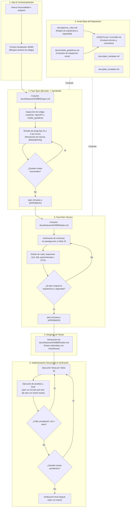

# Metodología SDMD: Spec-Driven Mobile Development en MiraiLink Backend

Este documento describe la adopción formal del estándar **SDMD (Spec-Driven Mobile Development)** en el backend de MiraiLink, adaptando los principios de Spec-Driven Development (SDD) al desarrollo de APIs RESTful de alto rendimiento en Express 5 y PostgreSQL 16 que dan servicio directo a la aplicación móvil Android MiraiLink (Clean Architecture, Jetpack Compose, Room Database y WebSocket/Socket.IO).

- - -

## 1. Resumen Ejecutivo y Filosofia de Diseño

### 1.1. El Problema: Indeterminismo y el Sesgo del Happy Path
Los Modelos de Lenguaje Grande (LLMs) y asistentes de codificación presentan tres fallos críticos cuando se les solicita código de backend sin un arnés estructurado:
1. **Sesgo del Happy Path**: Suponen conectividad ininterrumpida, datos siempre consistentes y clientes infalibles. Ignoran fallos de red en dispositivos móviles, reintentos concurrentes que provocan condiciones de carrera (race conditions), payloads incompletos, errores de serialización y códigos de error ambiguos.
2. **Desconexión con las Restricciones del Cliente Móvil**: Disenan endpoints sin contemplar límites de ancho de banda, consumo de batería, tiempos de espera (timeouts) en conexiones móviles 4G/5G inestables, payloads pesados que degradan la memoria del dispositivo y la necesidad de soportar el modo offline o sincronización asíncrona.
3. **Alucinación de Dependencias y Versiones**: Tienden a proponer métodos deprecados, middleware obsoleto o paquetes incompatibles con Node.js 22, Express 5 o PostgreSQL 16 sin verificar el catálogo de dependencias (`package.json`).

### 1.2. La Solución: El Arnés de Seguridad (Safety Harness)
SDMD establece una regla inquebrantable: **el código de producción nunca se genera directamente a partir de una idea o solicitud informal**.

Entre la intención inicial y la primera línea de código ejecutable se despliega un arnés documental determinista:
- Se inspecciona el repositorio antes de asumir (`AGENTS.md`, `docs/architecture.md`, `docs/api-reference.md`, `docs/openapi.yaml`, `package.json`).
- Se encapsulan las decisiones funcionales y de contrato móvil en `spec.md`.
- Se auditan las limitaciones del cliente móvil y la resiliencia de red con `docs/mobile_guidelines.md`.
- Se disena la arquitectura técnica con dependencias reales verificadas en `plan.md`.
- Se desglosa en tareas atómicas y testeables en `tasks.md`.

- - -

## 2. Enfoque Adoptado: Spec-Anchor

MiraiLink Backend adopta el modelo **Spec-Anchor**:
- Las especificaciones y planes se redactan, aprueban y versionan en Git dentro del directorio `docs/features/<nombre-feature>/`.
- Conveven de forma permanente y viva junto al código fuente de la aplicación.
- Garantizan memoria histórica para futuros desarrolladores y agentes de IA, evitando regresiones arquitectónicas o divergencias de contrato con la aplicación móvil.

- - -

## 3. Diagrama de Flujo Mermaid del Ciclo SDMD


```mermaid
flowchart TD
    subgraph F0["0. Arnés Base del Repositorio"]
        AG["AGENTS.md / CLAUDE.md<br/>(Contexto técnico y comandos)"]
        GR["docs/generic_rules.md<br/>(Reglas de arquitectura y seguridad)"]
        MG["docs/mobile_guidelines.md<br/>(Contratos de integración móvil)"]
        ST["docs/spec_template.md"]
        PT["docs/plan_template.md"]
        GR --> AG
        MG --> AG
    end

    subgraph F1["1. Idea & Contextualización"]
        IDEA["Nueva funcionalidad o endpoint"] --> PROMPT_INIT["Prompt Inicializador SDMD<br/>(Bloqueo estricto de código)"]
    end

    subgraph F2["2. Fase Spec (Borrador -> Aprobado)"]
        PROMPT_INIT --> DRAFT_SPEC["Creación docs/features/NOMBRE/spec.md"]
        DRAFT_SPEC --> INSPECT["Inspección de código existente, OpenAPI y mobile_guidelines"]
        INSPECT --> Q_ROUNDS["Rondas de preguntas (3 a 5 por turno)<br/>(Resolución de marcas [PENDIENTE])"]
        Q_ROUNDS --> REVIEW_SPEC{"¿Quedan dudas funcionales?"}
        REVIEW_SPEC -- Si --> Q_ROUNDS
        REVIEW_SPEC -- No --> SPEC_OK["spec.md pasa a [APROBADO]"]
    end

    subgraph F3["3. Fase Plan Técnico"]
        SPEC_OK --> DRAFT_PLAN["Creación docs/features/NOMBRE/plan.md"]
        DRAFT_PLAN --> DEP_CHECK["Verificación de versiones en package.json y Node 22"]
        DEP_CHECK --> ARCH["Diseño de rutas, esquemas Zod, SQL parametrizado y DTOs"]
        ARCH --> REVIEW_PLAN{"¿El plan respeta la arquitectura y seguridad?"}
        REVIEW_PLAN -- No --> DEP_CHECK
        REVIEW_PLAN -- Si --> PLAN_OK["plan.md pasa a [APROBADO]"]
    end

    subgraph F4["4. Desglose de Tareas"]
        PLAN_OK --> TASKS["Generación de docs/features/NOMBRE/tasks.md<br/>(Fases ordenadas con checkboxes)"]
    end

    subgraph F5["5. Implementación Secuencial & Verificación"]
        TASKS --> EXEC["Ejecución Tarea por Tarea [x]"]
        EXEC --> TESTS["Ejecución de pruebas y linter<br/>(npm run lint && npm test && npm run check:routes)"]
        TESTS --> TEST_FAIL{"¿Falla compilación, lint o tests?"}
        TEST_FAIL -- Si --> EXEC
        TEST_FAIL -- No --> HAS_NEXT{"¿Quedan tareas pendientes?"}
        HAS_NEXT -- Si --> EXEC
        HAS_NEXT -- No --> FINAL_VAL["Verificación final integral (npm run check)"]
    end

    F0 -. Contexto .- F2
    F0 -. Contexto .- F3
```

- - -

## 4. Estructura de Documentos en el Repositorio

```text
MiraiLink-Backend/
├── AGENTS.md                      # Contexto global y comandos para asistentes IA
├── CLAUDE.md                      # Puntero de contexto para Claude (@AGENTS.md)
├── README.md                      # Documentación principal en español
├── README.en.md                   # Documentación en inglés (i18n)
├── docs/
│   ├── SDMD.md                    # Esta guía metodológica
│   ├── PROMPTS.md                 # Prompts inicializadores y de flujo
│   ├── generic_rules.md           # Reglas transversales de diseño backend
│   ├── mobile_guidelines.md       # Directrices de integración con la app móvil
│   ├── spec_template.md           # Plantilla canónica de especificación funcional
│   ├── plan_template.md           # Plantilla canónica de plan técnico
│   ├── architecture.md            # Arquitectura del servicio y pipeline HTTP
│   ├── api-reference.md           # Catálogo de operaciones de la API
│   ├── openapi.yaml               # Contrato formal OpenAPI 3.1
│   ├── database.md                # Esquema relacional PostgreSQL y migraciones
│   ├── code-reference.md          # Referencia técnica de módulos y exports
│   ├── codebase-map.md            # Mapa estructural del repositorio
│   ├── runtime-and-configuration.md # Variables de entorno y lifecycle
│   ├── security-review.md         # Auditoría y controles de seguridad
│   ├── testing-strategy.md        # Estrategia de testing y suites Vitest
│   ├── future-vps-deployment.md   # Guía de despliegue en servidor de producción
│   └── features/                  # Directorio persistente de features (Spec-Anchor)
│       └── <nombre-feature>/
│           ├── spec.md            # Especificación aprobada
│           ├── plan.md            # Plan técnico aprobado
│           └── tasks.md           # Checklist secuencial de tareas
```

- - -

## 5. Guía de Ejecución Paso a Paso

1. **Paso 0 (Arnés Base)**: Mantener actualizadas las directrices en `docs/generic_rules.md` y `docs/mobile_guidelines.md`.
2. **Paso 1 (Contextualización)**: Al recibir un requerimiento de nueva funcionalidad, bloquear cualquier intento de generación directa de código de producción.
3. **Paso 2 (Especificación)**: Copiar `docs/spec_template.md` a `docs/features/<feature>/spec.md`. Inspeccionar el código actual y el contrato OpenAPI. Marcar dudas con `[PENDIENTE]` y formular de 3 a 5 preguntas concretas. Al resolverlas, cambiar estado a `[APROBADO]`.
4. **Paso 3 (Plan Técnico)**: Copiar `docs/plan_template.md` a `docs/features/<feature>/plan.md`. Comprobar dependencias reales en `package.json`, modelar las consultas SQL parametrizadas, esquemas Zod, proyecciones DTO y cambios en `docs/openapi.yaml`.
5. **Paso 4 (Tareas)**: Crear `docs/features/<feature>/tasks.md` estructurado en fases con verificaciones de tests asociadas.
6. **Paso 5 (Implementación)**: Resolver una tarea a la vez. Ejecutar `npm run lint`, `npm test` y `npm run check:routes` antes de marcar `[x]`.
7. **Paso 6 (Verificación Final)**: Ejecutar la suite integral con `npm run check` y comprobar la compatibilidad de contrato con la aplicación móvil cliente.
