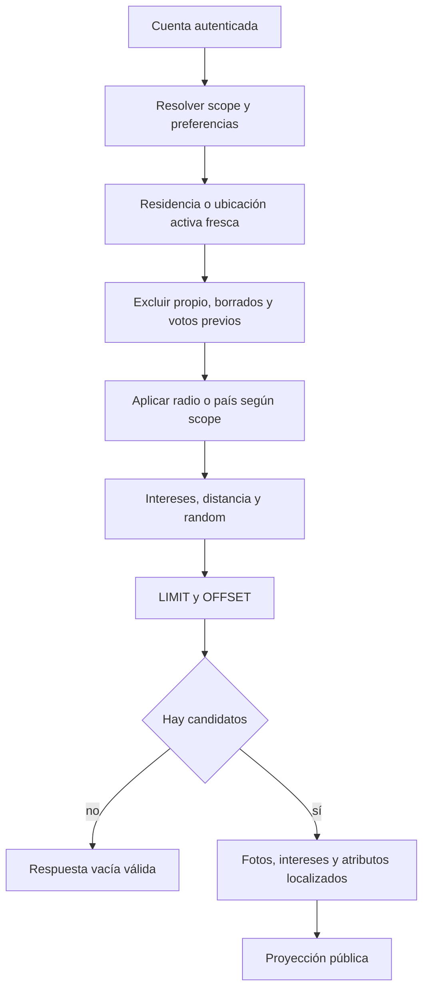

# Actividad de descubrimiento

[Índice](indice.md) | [Guía maestra](../guia-maestra.md)

Tipo: actividad representada como flowchart. Revisión: 2026-10-01. Fuentes: [src/controllers/swipe.controller.js](../../src/controllers/swipe.controller.js), [src/utils/geoSearch.js](../../src/utils/geoSearch.js).

Ranking aleatorio no garantiza orden estable entre páginas. El flujo describe SQL/controlador, no un SLA de rendimiento ni autorización Premium certificada por proveedor.
