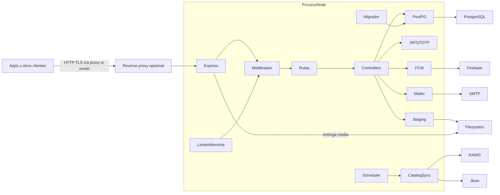

# Contexto, componentes y despliegue

[Índice](indice.md) | [Guía maestra](../guia-maestra.md)

Tipo: vista de contexto y componentes. Revisión: 2026-10-01. Fuentes: [src/app.js](../../src/app.js), [src/server.js](../../src/server.js), [src/models/db.js](../../src/models/db.js).

Proxy es topología opcional, no despliegue confirmado. Las fotos y DB tienen persistencias diferentes; rate limit/cache no se comparten entre procesos. El servidor se basa en HTTP y no inicia Socket.IO en las fuentes revisadas.
