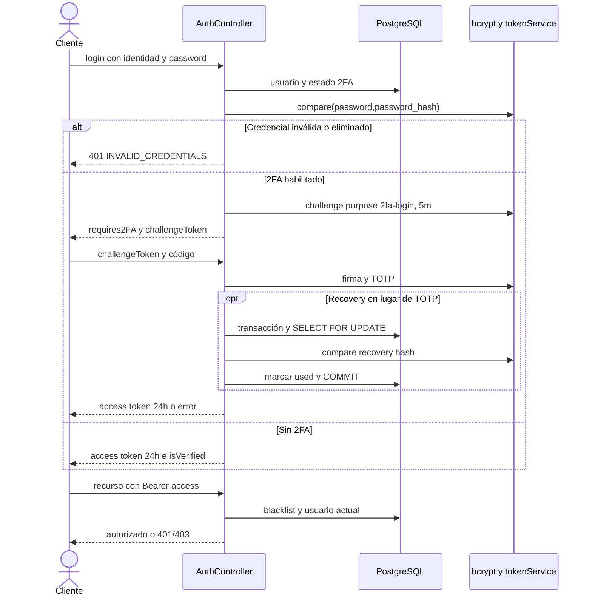

# Login, 2FA y autorización

[Índice](indice.md) | [Guía maestra](../guia-maestra.md)

Tipo: UML de secuencia. Revisión: 2026-10-01. Fuentes: [src/controllers/auth.controller.js](../../src/controllers/auth.controller.js), [src/services/tokenService.js](../../src/services/tokenService.js), [src/services/twoFactorService.js](../../src/services/twoFactorService.js), [src/middleware/auth.middleware.js](../../src/middleware/auth.middleware.js).

La última fase de autorización representa middleware, no otra ejecución del handler login. La verificación de cuenta sigue siendo requisito de las rutas protegidas; no confundir autenticación con resource authorization.
