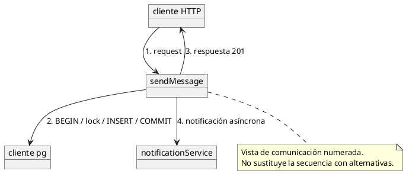

# UML: comunicación

[Índice](indice.md) | [Fuente editable PlantUML](comunicacion.puml)

Vista derivada del código versionado, revisada el 2026-10-01. No contiene datos reales. Ver [arquitectura](../estudio/arquitectura.md), [seguridad](../estudio/autenticacion-y-seguridad.md) y [mensajería](../estudio/flujos/chat.md) para fuentes, comportamiento y alternativas.

Para visualizar, abrir el archivo .puml en un editor/renderer PlantUML local. No enviar código privado a servicios públicos. La vista de overview es una actividad que agrupa interacciones; estructura compuesta es una vista de componentes internos. No se presentan como un metamodelo UML formal validado.
