# er-seguridad-social

[Índice de diagramas](indice.md) | [Diccionario del esquema](../estudio/diccionario-esquema.md).

Tipo: entidad-relación, no UML. Incluye entidades de la vista y relaciones SQL declaradas. Padre obligatorio: ||; padre opcional: |o; hijos: o{ o un máximo de uno cuando la FK es única. Las tablas puente usan PK compuesta descrita en el diccionario.

```mermaid
erDiagram
    users {
        UUID id PK
        VARCHAR username UK
        VARCHAR nickname
        VARCHAR email UK
        VARCHAR phone_number UK
        TEXT password_hash
        auth_provider auth_provider
        BOOLEAN is_verified
        TEXT bio
        VARCHAR gender
        DATE birthdate
        DOUBLE residence_latitude
        DOUBLE residence_longitude
        DOUBLE current_latitude
        DOUBLE current_longitude
        TIMESTAMP last_location_updated_at
        TIMESTAMP created_at
        TIMESTAMP updated_at
        BOOLEAN is_deleted
        UUID residence_country_id FK
        UUID residence_region_id FK
        UUID residence_city_id FK
        VARCHAR profession
        UUID religion_id FK
        UUID zodiac_sign_id FK
        UUID political_stance_id FK
        UUID smoking_habit_id FK
        UUID drinking_habit_id FK
        UUID sexual_orientation_id FK
        UUID education_level_id FK
    }
    token_blacklist {
        TEXT token PK
        TIMESTAMP invalidated_at
        TIMESTAMPTZ expires_at
    }
    verification_tokens {
        UUID id PK
        UUID user_id FK
        VARCHAR type
        TIMESTAMP expires_at
        TIMESTAMP created_at
        VARCHAR token_hash
    }
    password_reset_tokens {
        UUID id PK
        UUID user_id FK
        TIMESTAMP expires_at
        TIMESTAMP created_at
        VARCHAR token_hash
    }
    user_photos {
        UUID id PK
        UUID user_id FK
        TEXT url
        INT position
    }
    likes {
        UUID id PK
        UUID from_user_id FK
        UUID to_user_id FK
        TIMESTAMP created_at
    }
    dislikes {
        UUID id PK
        UUID from_user_id FK
        UUID to_user_id FK
        TIMESTAMP created_at
    }
    matches {
        UUID id PK
        UUID user1_id FK
        UUID user2_id FK
        BOOLEAN seen_by_user1
        BOOLEAN seen_by_user2
        TIMESTAMP created_at
    }
    chats {
        UUID id PK
        TEXT type
        TEXT name
        UUID created_by FK
        TIMESTAMP created_at
    }
    chat_members {
        UUID chat_id PK, FK
        UUID user_id PK, FK
        TEXT role
        TIMESTAMP joined_at
        TIMESTAMP last_read_at
    }
    messages {
        UUID id PK
        UUID sender_id FK
        UUID chat_id FK
        BOOLEAN is_read
        TIMESTAMP created_at
        TEXT text
        TIMESTAMP sent_at
    }
    push_tokens {
        UUID id PK
        UUID user_id FK, UK
        TEXT token
        TEXT platform
        TIMESTAMP created_at
    }
    reports {
        UUID id PK
        UUID reported_by FK
        UUID reported_user FK
        TEXT reason
        TIMESTAMP created_at
    }
    feedback {
        UUID id PK
        UUID user_id FK
        TEXT message
        TIMESTAMP created_at
    }
    user_2fa {
        UUID user_id PK, FK
        TEXT secret
        BOOLEAN enabled
    }
    recovery_codes {
        SERIAL id PK
        UUID user_id FK
        TEXT code_hash
        BOOLEAN used
    }
    app_versions {
        TEXT platform PK
        INTEGER min_supported_version_code
        INTEGER latest_version_code
        TEXT message
        TEXT play_store_url
        TIMESTAMPTZ updated_at
    }
    user_subscriptions {
        UUID id PK
        UUID user_id FK
        VARCHAR product_id
        VARCHAR base_plan_id
        TEXT purchase_token
        VARCHAR order_id
        VARCHAR status
        BOOLEAN auto_renewing
        TIMESTAMPTZ start_date
        TIMESTAMPTZ expires_at
        TIMESTAMPTZ last_verified_at
        TIMESTAMPTZ created_at
        TIMESTAMPTZ updated_at
    }
    schema_migrations {
        TEXT filename PK
        TIMESTAMPTZ applied_at
    }
    users |o--o{ verification_tokens : "user_id"
    users |o--o{ password_reset_tokens : "user_id"
    users |o--o{ user_photos : "user_id"
    users |o--o{ likes : "from_user_id"
    users |o--o{ likes : "to_user_id"
    users |o--o{ dislikes : "from_user_id"
    users |o--o{ dislikes : "to_user_id"
    users |o--o{ matches : "user1_id"
    users |o--o{ matches : "user2_id"
    users |o--o{ chats : "created_by"
    chats ||--o{ chat_members : "chat_id"
    users ||--o{ chat_members : "user_id"
    users |o--o{ messages : "sender_id"
    chats |o--o{ messages : "chat_id"
    users |o--o| push_tokens : "user_id"
    users |o--o{ reports : "reported_by"
    users |o--o{ reports : "reported_user"
    users |o--o{ feedback : "user_id"
    users ||--o| user_2fa : "user_id"
    users |o--o{ recovery_codes : "user_id"
    users ||--o| user_subscriptions : "user_id"
```

El esquema contiene tablas y columnas legacy conservadas; su presencia no acredita uso activo en todos los handlers. Ver las fuentes y los hallazgos.
