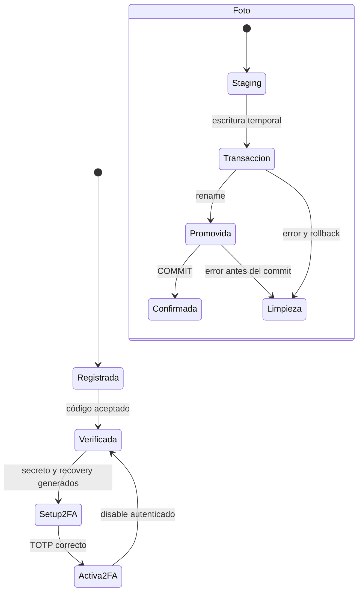

# Estados de cuenta y actividad de uploads

[Índice](indice.md) | [Guía maestra](../guia-maestra.md)

Tipo: UML de estados. Revisión: 2026-10-01. Fuentes: [src/controllers/auth.controller.js](../../src/controllers/auth.controller.js), [src/controllers/photo.controller.js](../../src/controllers/photo.controller.js), [src/utils/photoStorage.js](../../src/utils/photoStorage.js).

Cuenta y upload son subprocesos independientes, reunidos para comparar estados. Setup devuelve material sensible antes de activar 2FA. La limpieza puede fallar y el filesystem no tiene rollback PostgreSQL.
