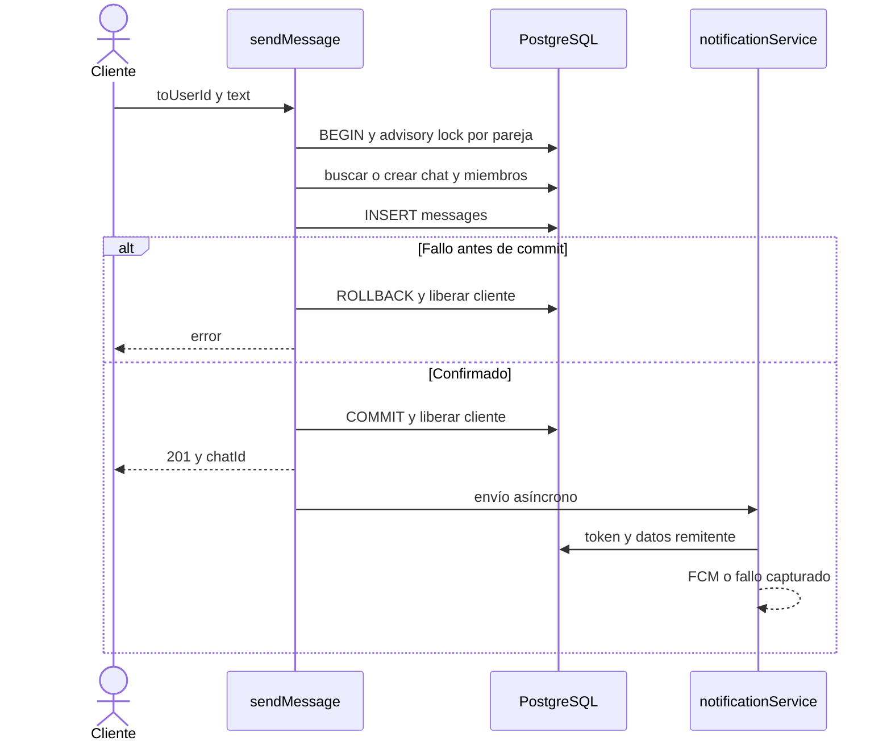

# Escritura de mensaje y notificación

[Índice](indice.md) | [Guía maestra](../guia-maestra.md)

Tipo: UML de secuencia. Revisión: 2026-10-01. Fuentes: [src/controllers/chat.controller.js](../../src/controllers/chat.controller.js), [src/services/notificationService.js](../../src/services/notificationService.js).

No exige match previo ni recibe clave idempotente. La notificación puede fallar después de que el mensaje ya esté guardado. El historial y last_read_at son consultas/marcas distintas del envío.
