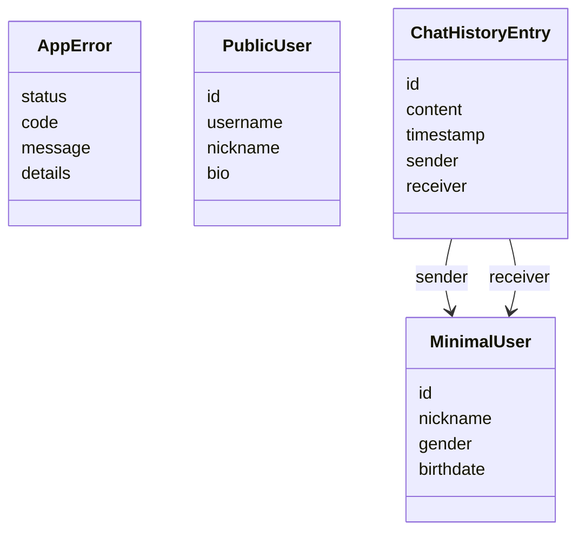

# Clases y formas públicas del servidor

[Índice](indice.md). Tipo: UML de clases/formas de datos simplificado. Fuentes: [AppError](../../src/errors/AppError.js), [DTO usuario](../../src/dto/user.dto.js), [chat controller](../../src/controllers/chat.controller.js).

AppError es una clase del código. Las otras cajas son formas de datos proyectadas y no constructores JavaScript. Solo se muestran campos esenciales: el contrato completo está en DTO/OpenAPI. No confundir DTO con tablas ni inferir campos privados.
